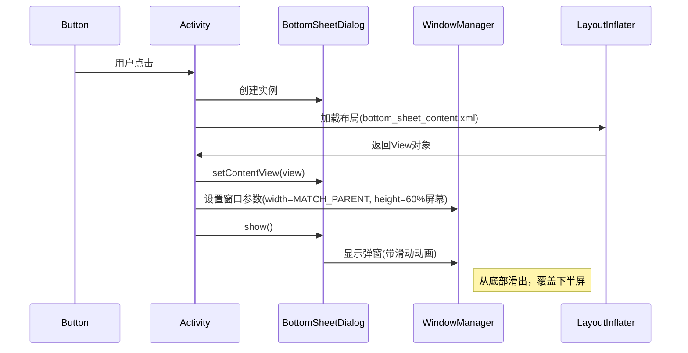

## 1.button背景属性background不生效问题


## 2.实现从底部弹出的半屏窗口效果 **BottomSheet**


### **代码分解说明**
```java
// 1. 获取布局中的按钮实例
Button btnShow = findViewById(R.id.btn_show_bottom_sheet);

// 2. 设置按钮点击监听器
btnShow.setOnClickListener(v -> {
    
    // 3. 创建BottomSheetDialog实例
    BottomSheetDialog dialog = new BottomSheetDialog(this);
    
    // 4. 加载弹窗内容布局
    View view = getLayoutInflater().inflate(R.layout.bottom_sheet_content, null);
    
    // 5. 将布局设置给弹窗
    dialog.setContentView(view);
    
    // 6. 设置弹窗高度（核心逻辑）
    if (dialog.getWindow() != null) {
        // 获取窗口参数
        WindowManager.LayoutParams params = dialog.getWindow().getAttributes();
        
        // 设置宽度为全屏
        params.width = WindowManager.LayoutParams.MATCH_PARENT;
        
        // 设置高度为屏幕高度的60%
        params.height = (int) (getResources().getDisplayMetrics().heightPixels * 0.6);
        
        // 应用参数
        dialog.getWindow().setAttributes(params);
    }

    // 7. 绑定关闭按钮事件
    view.findViewById(R.id.btn_close).setOnClickListener(v2 -> {
        dialog.dismiss(); // 关闭弹窗
    });
    
    // 8. 显示弹窗
    dialog.show();
});
```

---

### **关键逻辑图解**


---

### **重点技术细节**
1. **`dialog.getWindow()`**  
   - 获取弹窗的顶层窗口对象
   - 必须判空处理（极少数情况可能为null）

2. **`WindowManager.LayoutParams`**  
   - `width = MATCH_PARENT`：强制弹窗横向撑满
   - `height` 动态计算：  
     ```java
     // 获取屏幕像素高度
     int screenHeight = getResources().getDisplayMetrics().heightPixels;
     // 设置为60%高度
     int dialogHeight = (int) (screenHeight * 0.6);
     ```

3. **`dismiss()` vs `cancel()`**  
   - `dismiss()`：单纯关闭弹窗
   - `cancel()`：会触发`OnCancelListener`

4. **内存管理**  
   - 匿名内部类持有外部引用（建议在`onDestroy`中调用`dialog.dismiss()`）

---

### **可能遇到的问题与解决方案**
| 问题现象             | 原因                            | 修复方案                                                     |
| -------------------- | ------------------------------- | ------------------------------------------------------------ |
| 弹窗高度不符合预期   | 设备厂商修改了WindowManager实现 | 改用`BottomSheetBehavior.from(view).setPeekHeight()`         |
| 点击外部无法关闭     | 默认开启`cancelable`            | `dialog.setCancelable(false)` 显式禁用                       |
| 背景无半透明遮罩     | 主题未设置背景                  | 添加style：`<item name="android:backgroundDimEnabled">true</item>` |
| 底部内容被导航栏遮挡 | 未考虑系统导航栏高度            | 计算高度时减去`getNavigationBarHeight()`                     |

---

### **性能优化建议**
1. **复用Dialog实例**  
   ```java
   // 在Activity中缓存Dialog
   private BottomSheetDialog mDialog;
   
   if (mDialog == null) {
       mDialog = new BottomSheetDialog(this);
       //...初始化代码
   }
   mDialog.show();
   ```

2. **延迟加载复杂布局**  
   ```java
   view.post(() -> {
       // 在布局完成后加载耗时内容
       loadHeavyData();
   });
   ```

3. **使用ViewBinding**  
   ```java
   // 替代findViewById
   BottomSheetContentBinding binding = BottomSheetContentBinding.inflate(getLayoutInflater());
   dialog.setContentView(binding.getRoot());
   binding.btnClose.setOnClickListener(...);
   ```

---

### **与其他技术的对比**
```java
// 方式1：使用系统Dialog
AlertDialog.Builder(this)
    .setView(R.layout.bottom_sheet_content)
    .show();

// 方式2：使用DialogFragment
class MyDialogFragment extends DialogFragment {
    @Override
    public Dialog onCreateDialog(Bundle savedInstanceState) {
        return new BottomSheetDialog(requireContext());
    }
}

// 方式3：直接使用BottomSheetBehavior（嵌入Activity布局）
BottomSheetBehavior.from(bottom_sheet_layout).state = STATE_EXPANDED;
```

---

通过这种实现方式，您获得了：
1. **标准化**：符合Material Design规范
2. **高性能**：避免FragmentManager开销
3. **灵活性**：可动态调整大小和内容
4. **兼容性**：从Android 5.0 (API 21) 开始支持